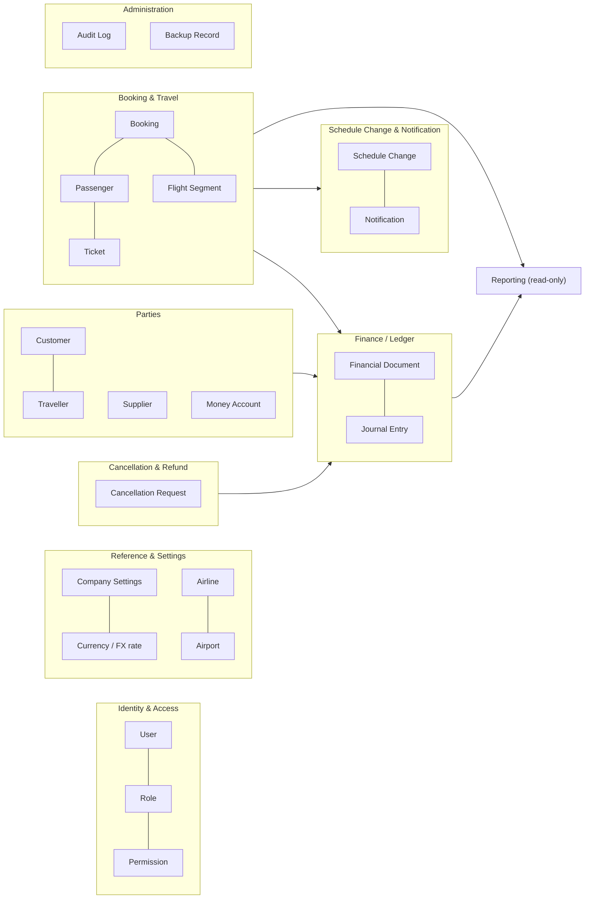
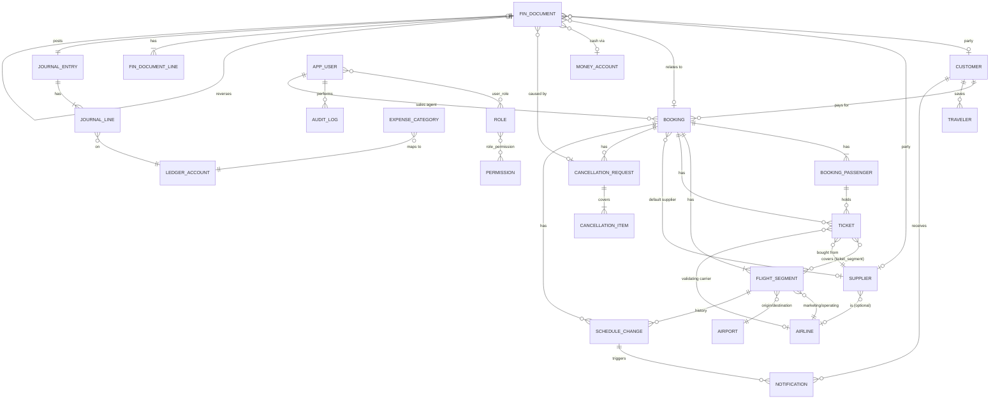

# 02 — Domain Model & Relationships

Covers deliverable items **C** (domain model) and **F** (relationships), report section
**4. Domain Model**.

---

## 1. Bounded contexts



| Context | Responsibility | Owns (aggregates) |
|---|---|---|
| Identity & Access | Authentication, sessions, RBAC | User, Role |
| Reference & Settings | White-label profile, currencies, rates, airlines, airports, numbering | CompanyProfile, Currency, ExchangeRate, Airline, Airport |
| Parties | Who we deal with and where money sits | Customer (+ Travellers), Supplier, MoneyAccount |
| Booking & Travel | What was sold, to whom, which flights | Booking (+ Passengers, Segments, Tickets) |
| Finance / Ledger | Every monetary fact; balances; profit | FinancialDocument (+ Lines, JournalEntry) |
| Cancellation & Refund | Asynchronous cancel/refund workflow | CancellationRequest |
| Schedule Change & Notification | Change detection, customer contact | ScheduleChange, Notification, MessageTemplate |
| Reporting | Read-only projections, never writes | — |
| Administration | Audit trail, backups | AuditLog (append-only), BackupRecord |

**Dependency rule:** Finance knows nothing about bookings' internals; it only receives
posting requests carrying dimension IDs (customer, supplier, booking, ticket). Operations
never writes journal rows directly — it calls the posting service. Reporting reads
everything, writes nothing.

---

## 2. Aggregates, entities and invariants

### 2.1 Booking (aggregate root)
```
Booking
 ├─ bookingNo, status, customerId, bookingDate, issueDate, dueDate, ticketingDeadline
 ├─ primaryPnr, tripType, defaultSupplierId, saleCurrency, salesAgentId
 ├─ contact { name, mobile(E.164), whatsapp, email }      ← snapshot for notifications
 ├─ passengers[1..n]   { seq, paxType ADT/CHD/INF, names (Latin + Arabic), passport, mobile, status }
 ├─ segments[1..n]     { seq, marketing/operating airline, flightNo, origin, destination,
 │                       local dep/arr date+time, derived UTC, cabin, RBD, airlineLocator,
 │                       status, version }
 └─ tickets[0..n]      { passengerId, ticketNumber, validatingAirline, supplierId, status,
                         issueDate, exchangedFromTicketId, coupons → segments[] }
```
Invariants:
- Passengers and segments are numbered 1..n uniquely within the booking.
- A ticket belongs to exactly one passenger of the same booking and covers ≥1 segment of
  the same booking.
- Status transitions only as in [05-state-machines.md](05-state-machines.md).
- Once ISSUED, the aggregate exposes **no setter for money**; monetary facts are
  documents in the Finance context referencing `bookingId`/`ticketId`.
- Every segment schedule edit after issue produces a `ScheduleChange` and bumps
  `segment.version`.

### 2.2 Customer / Supplier / MoneyAccount
- **Customer**: identity + contact + terms. Balance is *not* a column; it is a
  projection of the journal (account 1200, dimension customer).
- **Traveller**: reusable passenger profile, optionally tied to a customer. Booking
  passengers copy (snapshot) traveller data at booking time — later profile edits do not
  rewrite historical tickets.
- **Supplier**: identity + contact + terms + optional `airlineId` when the supplier *is*
  that airline. Balance = projection of account 2100, dimension supplier.
- **MoneyAccount**: cash drawer / bank / wallet / card clearing; exactly one currency.
  Balance = projection of account 1110, dimension money account.

### 2.3 FinancialDocument (aggregate root, immutable)
```
FinancialDocument
 ├─ docType, docNo (gap-free per type/year), docDate, isReversal, reversalOfId
 ├─ party: customerId | supplierId | none; bookingId?; cancellationRequestId?
 ├─ cash: moneyAccountId?, paymentMethod?, paymentReference?
 ├─ currency, exchangeRate (frozen), totalMinor (>0), totalBaseMinor (frozen)
 ├─ reasonCode, description, createdAt, createdBy
 ├─ lines[1..n]  { lineType, bookingId?, passengerId?, ticketId?, expenseCategoryId?,
 │                 amountMinor (>0), baseAmountMinor }
 └─ journalEntry { entryDate, lines[2..n] { account, dimensions, currency,
                   debit/credit (txn), debit/credit (base) }, sealed }
```
Invariants:
- Σ line amounts = total; Σ journal debits = Σ journal credits (base) — sealed only when
  balanced.
- Created once, never modified. Reversal = new document with `reversalOfId`.
- Document date > company lock date.
- The **Sale** and **Purchase** of the brief are not separate tables: a *Sale* is a
  `CUSTOMER_INVOICE` (plus its later `CUSTOMER_CREDIT_NOTE`s); a *Purchase* is a
  `SUPPLIER_BILL` (plus `SUPPLIER_CREDIT_NOTE`s). *Customer Payment* =
  `CUSTOMER_RECEIPT`; *Supplier Payment* = `SUPPLIER_PAYMENT`; *Refund* =
  `CUSTOMER_REFUND` / `SUPPLIER_REFUND` (cash) together with credit notes (entitlement);
  *Expense* = `EXPENSE`. This gives one uniform, auditable mechanism for every money fact.

### 2.4 CancellationRequest (aggregate root, mutable workflow)
Scope (items: passengers/segments/tickets), type (VOID / REFUND / NON_REFUNDABLE),
supplier-side status, customer-side status, overall status, expected (memo) refund,
links to the documents it caused (`fin_document.cancellation_request_id`).

### 2.5 ScheduleChange & Notification
- **ScheduleChange**: segment, version before/after, before/after snapshots, changed
  fields, severity, source, notification status (+ who/when/note), customer response,
  superseded-by.
- **Notification**: channel, delivery mode (manual/provider), recipient snapshot, body
  snapshot, status, provider id, error, attempts, sent at/by, links to
  customer/booking/schedule change.
- **MessageTemplate**: code × channel × locale with placeholders.

### 2.6 User / Role / Permission
User ↔ Role many-to-many; Role ↔ Permission many-to-many. Permissions are code-defined
constants seeded into the DB; roles are data (custom roles possible).

### 2.7 AuditLog, BackupRecord, CompanyProfile, Settings
- **AuditLog**: append-only, hash-chained; written in the same DB transaction as the change.
- **CompanyProfile**: singleton white-label profile; base currency frozen after first posting.
- **AppSetting**: typed key/value (aging buckets, idle timeout, thresholds, backup policy).

---

## 3. Relationships (F)

### 3.1 Entity-relationship diagram



### 3.2 Relationship catalogue (the pairs requested in F)

| From | To | Cardinality | How it is stored | Notes |
|---|---|---|---|---|
| Customer | Booking | 1 : N | `booking.customer_id` | Customer is the payer. Changing a booking's customer after issue = reversal + re-posting under the new customer (rare, permissioned). |
| Booking | Passenger | 1 : 1..N | `booking_passenger.booking_id` | Passenger is a snapshot; optional link to reusable `traveler`. |
| Booking | Flight Segment | 1 : 1..N | `flight_segment.booking_id` | Ordered by `seq`. Multi-city and round trips supported. |
| Passenger | Ticket | 1 : 0..N | `ticket.passenger_id` | >1 when reissued (old ticket EXCHANGED, new ticket linked by `exchanged_from_ticket_id`). |
| Ticket | Flight Segment | N : M | `ticket_segment` | Coupons. |
| Flight Segment | Airline | N : 1 (+ optional operating) | `marketing_airline_id`, `operating_airline_id` | Codeshares. |
| Booking / Ticket | Supplier | N : 1 | `booking.default_supplier_id`, `ticket.supplier_id` | Supplier lives on the ticket (and on each purchase line); a booking can mix suppliers. |
| Supplier | Airline | N : 0..1 | `supplier.airline_id` | Only when the supplier *is* the airline. |
| Airline | Supplier finance | none | — | Airlines have no balances. |
| Sale | Booking / Customer | N : 1 | `fin_document(doc_type=CUSTOMER_INVOICE).booking_id/customer_id`; lines → `ticket_id`, `passenger_id` | A booking normally has 1 invoice + 0..N adjustments. |
| Purchase | Booking / Supplier | N : 1 | `fin_document(doc_type=SUPPLIER_BILL)` | One bill per supplier per issue event. |
| Customer Payment | Customer | N : 1 | `CUSTOMER_RECEIPT.customer_id` | Allocations to bookings = AR journal lines with `booking_id`; unallocated = `booking_id NULL`. |
| Customer Payment | Booking | N : M | journal lines (`account 1200`, `booking_id`) | One receipt may pay several bookings; one booking may have many receipts. |
| Supplier Payment | Supplier / Booking | same as above on account 2100 | | |
| Refund | Booking / Party | N : 1 | Credit notes (entitlement) + `CUSTOMER_REFUND`/`SUPPLIER_REFUND` (cash); linked to `cancellation_request` | |
| Any document | Its reversal | 1 : 0..1 | `fin_document.reversal_of_id` UNIQUE | |
| Expense | Category → Ledger account; Money account | N : 1 | `EXPENSE` document + line `expense_category_id` | |
| User | Role | N : M | `user_role` | |
| Role | Permission | N : M | `role_permission` | |
| User | Everything | 1 : N | `created_by`, `updated_by`, `changed_by`, `sent_by`, audit `user_id` | Every write is attributable. |
| Audit Log | Any entity | N : 1 (polymorphic) | `entity_type` + `entity_id` | Append-only. |
| Notification | Customer / Booking / Schedule change | N : 1 | FK columns | Recipient + body are snapshots. |
| Company Settings | Everything | singleton | `company_profile` (id = 1) + `app_setting` | Base currency, timezone, country, numbering, branding. |

### 3.3 Why balances are projections, not columns

Storing `customer.balance` or `booking.amount_paid` invites drift: two code paths update
it differently, a crash leaves it half-written, a migration forgets it. Instead:

- The only financial truth is `journal_line` (immutable, balanced).
- Balances are SQL views over indexed journal lines (see `v_booking_financials`,
  `v_customer_balance`, `v_supplier_balance`, `v_money_account_balance` in
  [schema-draft.sql](schema-draft.sql)).
- If Phase 8 performance tests show a view is too slow, a **projection table** is added,
  updated in the same transaction, and verified against the view by an integrity check —
  never the other way around.
