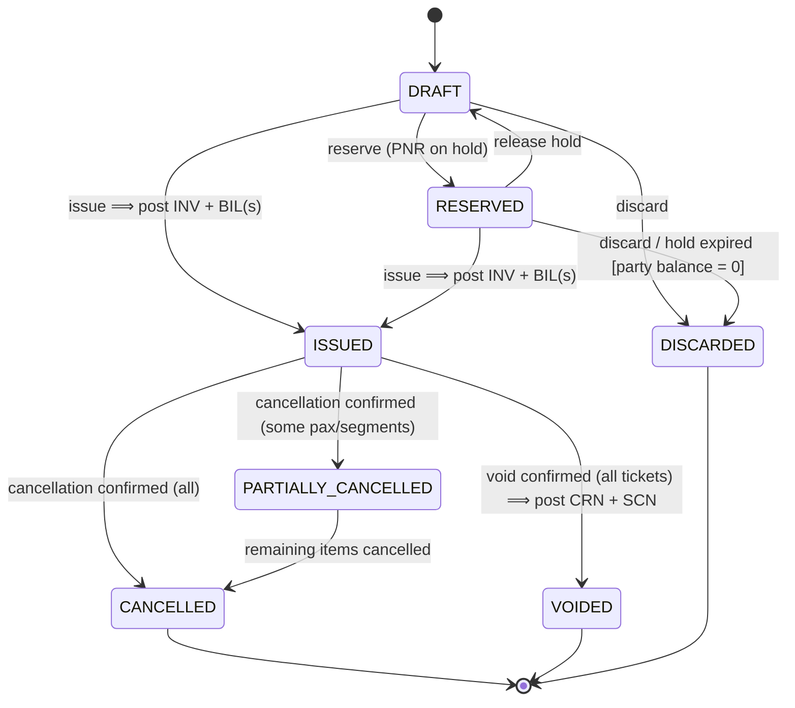
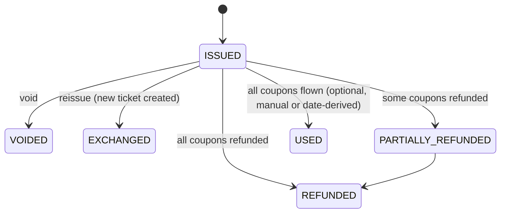
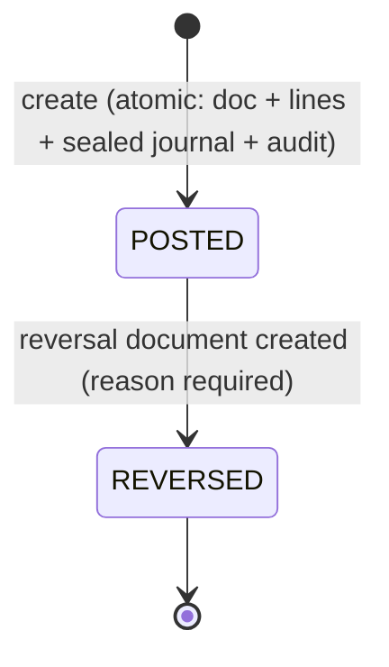
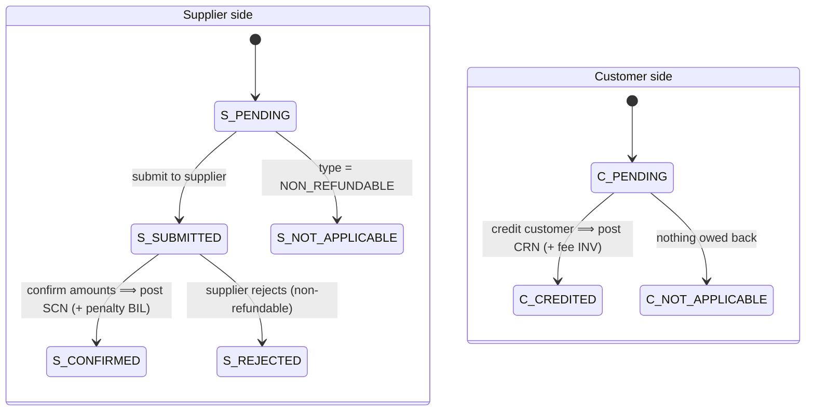
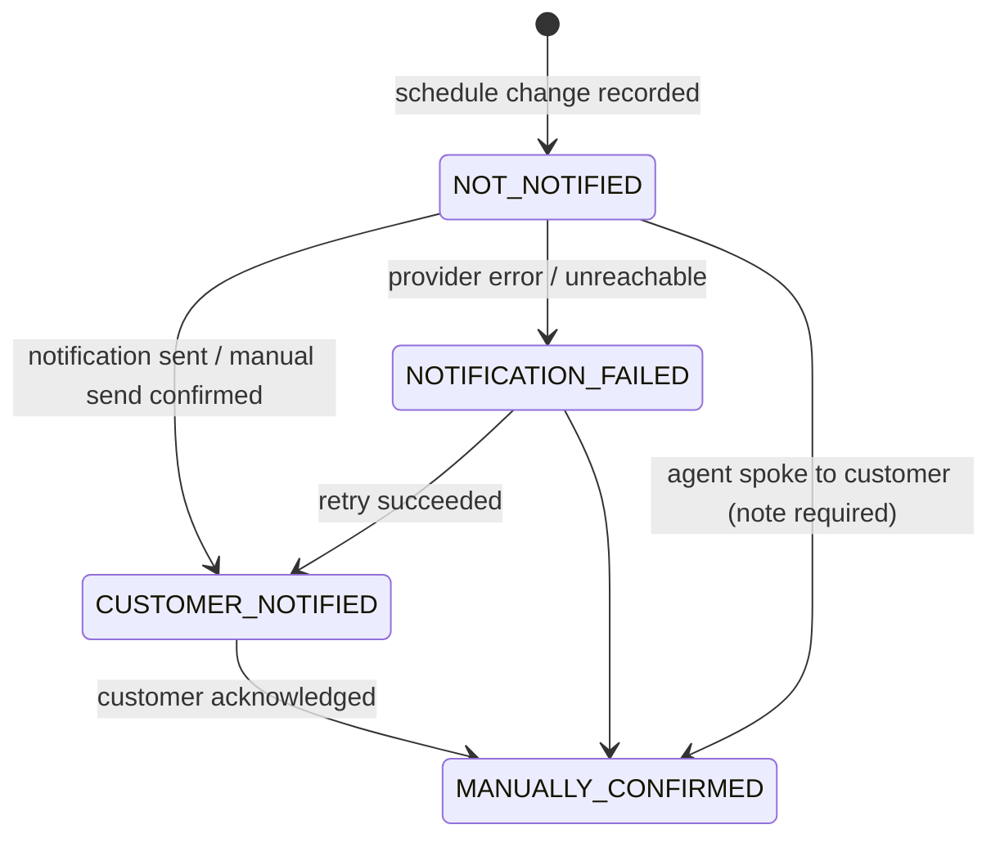
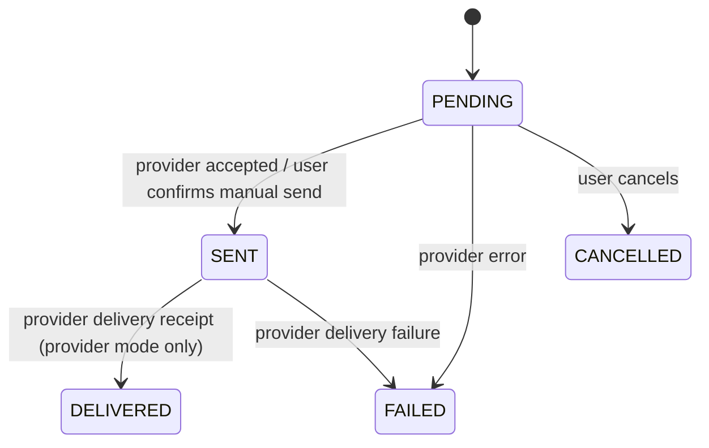
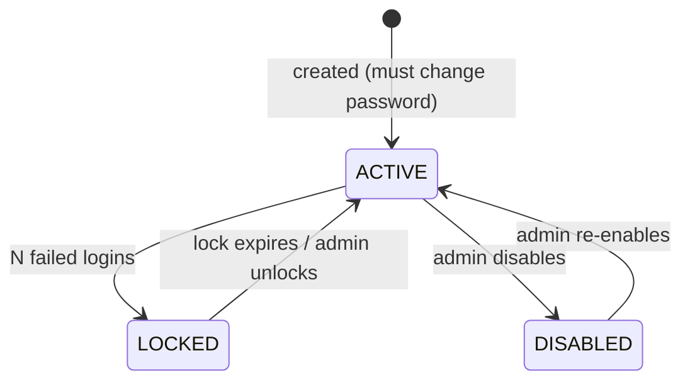

# 05 — State Machines

Covers deliverable item **G**, report section **7. State Machines**.

Every state machine is implemented as a pure, table-driven function in the domain
package (`transition(state, event, context) → newState | DomainError`), unit-tested
exhaustively (every state × every event), and every accepted transition is audited.
Financial statuses such as "paid" are **derived** from the journal, never stored.

---

## 1. Booking

| State | Meaning | Financial effect | Editable |
|---|---|---|---|
| DRAFT | Being prepared | none | everything |
| RESERVED | Seats held, not ticketed; ticketing deadline tracked | none (deposits allowed as customer credit on the booking) | everything; deadline alerts |
| ISSUED | Ticketed; sale and cost recognised | INV + BIL posted | non-financial fields (audited); money only through adjustment commands; schedule edits create change events |
| PARTIALLY_CANCELLED | Some passengers/segments cancelled | cancellation documents posted for those items | as ISSUED |
| CANCELLED | Everything cancelled | cancellation documents posted | notes only; refunds/settlements still allowed |
| VOIDED | Voided within void window | mirror credit notes (± void fee) | notes only |
| DISCARDED | Abandoned before issue | none | none (may be purged if never had documents) |

Guards:
- `issue`: BR-BKG-01 checks; `booking.issue` permission; doc date not locked.
- `discard` from RESERVED: customer balance on this booking must be 0 (BR-PAY-04).
- `void`: all tickets in ISSUED status, `booking.void`; requires the supplier void to be
  confirmed (see §4).
- "Reissued/exchanged" is **not** a booking status: it is an event on ISSUED producing
  a new ticket (old ticket → EXCHANGED) and adjustment documents.
- "Completed/Travelled" is derived (all active segments departed), not stored.

Derived settlement badges (computed per currency from the journal):

| Customer side | Condition |
|---|---|
| UNPAID | charged > 0, paid = 0 |
| PARTIALLY_PAID | 0 < paid < charged |
| PAID | balance = 0 |
| CREDIT (refund due) | balance < 0 |

Supplier side analogously: UNPAID / PARTIALLY_PAID / PAID / SUPPLIER_CREDIT.

## 2. Ticket

Terminal: VOIDED, EXCHANGED, REFUNDED, USED.

## 3. Financial document (receipt, payment, invoice, bill, expense …)

- There is **no DRAFT financial document** persisted: the UI form is the draft; on save
  the document is posted atomically or not at all. This removes a whole class of
  "half-posted" bugs.
- `REVERSED` is derived (`EXISTS reversal WHERE reversal_of_id = id`); the original row
  is never touched.
- A reversal cannot be reversed; post a new correct document instead.
- Reversal of a receipt whose cash was already refunded is blocked (would double-count);
  the refund must be reversed first.

## 4. Cancellation / refund request

Two parallel sides plus an overall state, because suppliers and customers settle on
different timelines.

| Overall | Rule |
|---|---|
| OPEN | Created; at least one side pending. |
| CLOSED | Both sides in a terminal state (CONFIRMED/REJECTED/NOT_APPLICABLE and CREDITED/NOT_APPLICABLE). Cash refunds may still follow; they are tracked by balances, not by this workflow. |
| WITHDRAWN | Customer changed their mind while both sides are still PENDING/SUBMITTED; nothing posted. |

Guards:
- `C_PENDING → C_CREDITED` while supplier side is not CONFIRMED requires
  `refund.customer_before_supplier` (Q6).
- `S_CONFIRMED` requires actual amounts; the difference vs. `expected_*` (memo) is shown.
- Cash refund to customer (`CUSTOMER_REFUND`) is limited to the customer's credit balance.
- Booking status moves to PARTIALLY_CANCELLED / CANCELLED / VOIDED when the request
  closes with posted documents.

## 5. Schedule change notification

- *Requires attention* = NOT_NOTIFIED ∪ NOTIFICATION_FAILED (and CUSTOMER_NOTIFIED for
  MAJOR changes if setting `schedule_change.major_requires_confirmation` is on).
- A new change on the same segment sets `superseded_by_id` on the previous one; only the
  latest unresolved change per segment counts for attention.
- Optional `customer_response` (ACCEPTED / REQUESTED_CHANGE / REQUESTED_REFUND) can start a
  reissue or a cancellation request.

## 6. Notification (delivery attempt)

Retries create a new notification row (full history of attempts).

## 7. User account

Users are never deleted (they are referenced by history). The last active Admin cannot be
disabled or lose the Admin role.

## 8. Financial period

`OPEN` ↔ `LOCKED` by moving `company_profile.financial_lock_date`. Moving it forward
(lock) requires `finance.lock_period`; moving it back (unlock) additionally requires a
reason and is highlighted in the audit report.

## 9. Backup / restore

See [10-backup-restore.md §5](10-backup-restore.md) for the restore state machine
(VALIDATING → READY → SAFETY_BACKUP → SWAPPING → VERIFYING → DONE | ROLLED_BACK), which is
crash-resumable through a marker file.
