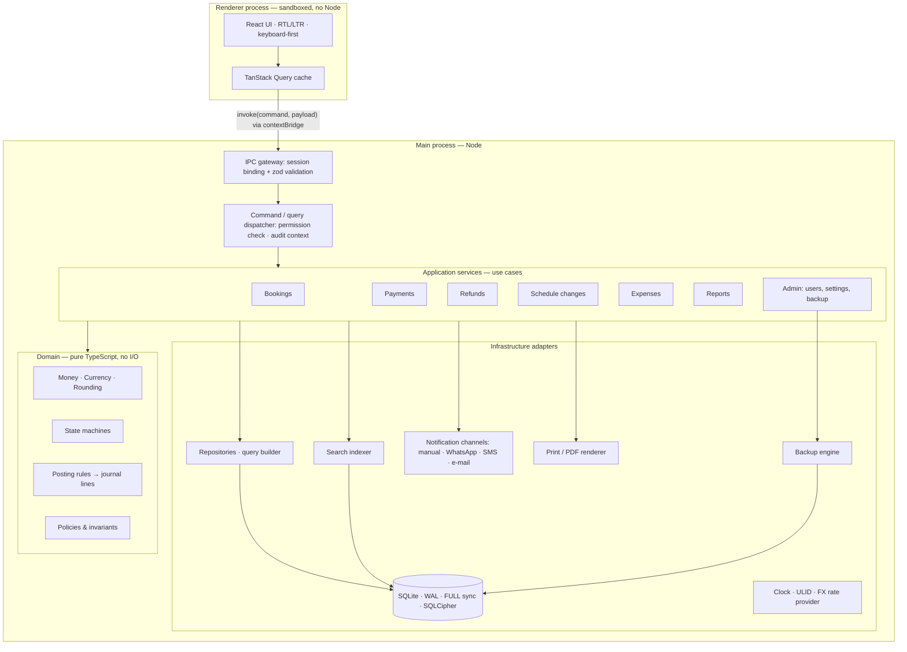

# 07 — Architecture, Technology Stack, Project Structure, Migrations

Covers deliverable items **I** (technology stack), **K** (project structure),
**L** (migration strategy) and report sections **10. Architecture** and
**11. Technology Stack**.

---

## 1. Architecture overview



### 1.1 Layering rules (enforced with `dependency-cruiser` in CI)

| Layer | May depend on | Must not depend on |
|---|---|---|
| `domain` | nothing (pure TS, decimal.js) | DB, Electron, Node APIs, clock |
| `contracts` | zod | everything else |
| `backend` (services + infra) | domain, contracts | renderer, Electron (except via the thin `apps/desktop` shell) |
| `apps/desktop` main | backend | renderer code |
| `apps/desktop` renderer | contracts, UI libs | backend, domain internals, Node |

### 1.2 Command/query pattern

- **Commands** (writes): `bookings.issue`, `payments.receiveCustomer`,
  `refunds.confirmSupplier`… Each: validate (zod) → authorise → open **one synchronous
  SQLite transaction** → load aggregate → domain logic → persist rows, journal, audit
  record, search index → commit → return DTO. Either everything is written or nothing.
- **Queries** (reads): read models over views; DTO mapping applies field redaction.
- **Idempotency**: every command carries a client-generated `commandId` (ULID) stored for
  24 h; a double-click or retry after a timeout cannot post a payment twice.
- The dispatcher is transport-agnostic: today it is fed by Electron IPC; a future **LAN
  server mode** exposes the same registry over authenticated HTTPS (see §7).

### 1.3 Why this shape

- Financial correctness lives in the **pure domain** → exhaustively unit-testable without
  a DB or Electron.
- One process owns the DB → one writer, no cross-process locking, synchronous
  transactions with no interleaving.
- The renderer is untrusted → a UI bug or XSS cannot bypass permissions or write SQL.

## 2. Technology stack (I)

| Concern | Choice | Notes |
|---|---|---|
| Shell | **Electron** (current stable at Phase 1 start, pinned) | Windows 10/11 x64. |
| Language | **TypeScript** (strict, `noUncheckedIndexedAccess`) everywhere | One language across domain, backend, UI, tests. |
| Runtime | Node bundled with Electron | |
| UI | **React** + **Vite** (via `electron-vite`) | |
| UI kit | Tailwind CSS (logical properties for RTL) + Radix primitives (shadcn/ui pattern) with `DirectionProvider` | Owned components, no licence cost. |
| Data grid | TanStack Table + TanStack Virtual | Keyboard navigation, 10k+ rows. |
| Forms | react-hook-form + zod (shared schemas from `contracts`) | Same validation client and server. |
| Routing / server state | TanStack Router / TanStack Query | |
| i18n | i18next (ar default, en), ICU plurals; Intl for numbers/dates | |
| Database | SQLite via `better-sqlite3-multiple-ciphers` | Sync API, SQLCipher-compatible encryption, online backup API. |
| Query layer | Type-safe query builder with synchronous better-sqlite3 support (**Drizzle ORM** as query builder); SQL migrations hand-written and reviewed | Final confirmation in Phase 1 spike (§5.3). |
| Money / FX | integer minor units; `decimal.js` for rates | |
| IDs | `ulid` | |
| Password hashing | `@node-rs/argon2` | Prebuilt Windows binaries. |
| Phone numbers | `libphonenumber-js` | E.164 normalisation. |
| Dates / time zones | `date-fns` + `@date-fns/tz` (IANA) | |
| Export | `exceljs` (XLSX), CSV writer with injection escaping | |
| Print / PDF | HTML templates → Electron `webContents.print` / `printToPDF` | Arabic shaping handled by Chromium; bundled fonts. |
| Fonts | IBM Plex Sans Arabic / Noto Naskh Arabic (OFL), bundled | Offline; no CDN. |
| Logging | `electron-log` (rotating files) | |
| Testing | Vitest, fast-check (property tests), Playwright (`_electron`), dependency-cruiser | See [09-testing-strategy.md](09-testing-strategy.md). |
| Packaging | `electron-builder` → NSIS installer; `electron-updater` (optional) | See [11-packaging.md](11-packaging.md). |
| Monorepo | pnpm workspaces | |
| CI | GitHub Actions (Linux: lint/type/test; Windows: build + packaged smoke test) | |

### 2.1 Alternatives considered

| Option | Strengths | Why not chosen |
|---|---|---|
| **.NET 8 + WPF/WinUI + EF Core + SQLite** | Native Windows, `decimal` type, small memory | Slower UI iteration; good RTL grids/reporting usually need paid component suites (DevExpress/Syncfusion); Windows-only build and test pipeline; weaker web-style i18n tooling. A credible second choice. |
| **Tauri (Rust + WebView2)** | Small binaries, low RAM | Two languages (Rust backend + TS UI) doubles the surface for the financial core; SQLCipher/Rust packaging and Windows cross-builds are harder; smaller ecosystem for desktop printing. |
| **Flutter desktop** | Single codebase, good performance | Weaker desktop data-grid/printing ecosystem; RTL mixed-script text fields and PDF Arabic shaping require extra work. |
| **Web app + local server** | Multi-PC for free | Violates "installable desktop EXE, offline-first" expectations and requires a server install/IT support. Retained as the *LAN server mode* evolution (§7). |

**Trade-offs we accept with Electron:** ~150–200 MB install size and ~250–400 MB RAM;
careful security hardening required (see [06 §10](06-security-and-permissions.md));
native module (`better-sqlite3`) must be rebuilt per Electron ABI — handled by
`electron-builder install-app-deps` and verified by the Windows smoke test.

**Minimum platform:** Windows 10 (22H2) / Windows 11, x64, 4 GB RAM, 1 GB free disk.
Windows 7/8.1 are **not** supported by current Electron (risk R7).

## 3. Project structure (K)

```
AirDesk/
├─ apps/
│  └─ desktop/
│     ├─ electron-builder.yml
│     ├─ src/
│     │  ├─ main/            # app lifecycle, window, IPC gateway, backend bootstrap
│     │  ├─ preload/         # contextBridge: invoke(command, payload) only
│     │  └─ renderer/
│     │     ├─ app/          # router, providers (i18n, direction, query, session)
│     │     ├─ features/     # bookings/, customers/, payments/, suppliers/, refunds/,
│     │     │                # schedule-changes/, expenses/, treasury/, reports/,
│     │     │                # dashboard/, settings/, users/, backup/
│     │     ├─ components/   # design system: MoneyInput, DateInput, PhoneInput, DataGrid…
│     │     └─ print/        # receipt, invoice, statement HTML templates
│     └─ resources/          # icons, bundled fonts, airport/airline seed data
├─ packages/
│  ├─ domain/                # PURE: money, currency, rounding, state machines,
│  │                         # posting rules, policies, invariants
│  ├─ contracts/             # zod command/query schemas, DTO types, permission codes,
│  │                         # error codes (shared by main & renderer)
│  ├─ backend/
│  │  ├─ src/db/             # connection, pragmas, migrator, repositories
│  │  ├─ src/migrations/     # 0001_init.sql, 0002_…sql (+ .ts data migrations)
│  │  ├─ src/services/       # use cases (command handlers, queries)
│  │  ├─ src/posting/        # document → journal builder (uses domain rules)
│  │  ├─ src/reports/        # declarative report definitions
│  │  ├─ src/search/         # normaliser + FTS indexer
│  │  ├─ src/notifications/  # channel port + manual/whatsapp-link adapters
│  │  ├─ src/backup/         # backup, validate, restore engine
│  │  ├─ src/audit/          # audit writer + hash chain verifier
│  │  └─ src/integrity/      # invariant checks (INV-1..10)
│  └─ i18n/                  # ar.json, en.json, formatting helpers
├─ tests/
│  ├─ scenarios/             # accounting acceptance scenarios (Cases A–M) — DSL
│  ├─ fixtures/              # historical DB files per released schema version
│  ├─ perf/                  # large dataset generators & budgets
│  └─ e2e/                   # Playwright Electron workflows
├─ docs/
│  ├─ phase-0/               # this specification
│  └─ adr/                   # architecture decision records (one per major decision)
├─ .github/workflows/        # ci.yml (linux), windows-build.yml
├─ package.json · pnpm-workspace.yaml · tsconfig.base.json · eslint config
└─ README.md
```

## 4. Search architecture

- One FTS5 table `search_index(entity_type, entity_id, content)` with the **trigram**
  tokenizer → substring search on names, PNRs, ticket numbers, phone fragments.
- Indexed entities: customer (name ar/latin, mobiles, email, customer_no), booking
  (booking_no, PNRs, airline locators, ticket numbers, passenger names, customer name,
  route), supplier, airline.
- **Normalisation** (applied identically on write and on query): NFKC; Arabic letter
  folding (أ إ آ ٱ → ا, ى → ي, ة → ه, ؤ → و, ئ → ي), strip tashkeel and tatweel; Arabic-Indic
  and Persian digits → ASCII; lower-case Latin; phone numbers additionally indexed as
  pure digits (national and E.164 forms).
- Queries < 3 characters fall back to prefix `LIKE` on indexed columns (trigram needs 3).
- Structured filters (date range, airline, supplier, status) are SQL predicates combined
  with the FTS hit list.
- Index maintained in the same transaction as the source write; a "rebuild index" admin
  action exists for recovery.
- Budget: < 150 ms p95 at 100k bookings (Phase 8 perf test).

## 5. Migration strategy (L)

### 5.1 Rules
1. **Forward-only**, numbered migrations (`0001_init.sql`, `0002_add_x.sql`, optional
   `0003_backfill_y.ts`) embedded in the app. No down-migrations; rollback = restore the
   automatic pre-migration backup.
2. `schema_migration` records version, name, **checksum** and app version. On startup a
   checksum mismatch for an applied migration → refuse to start (tampered or wrong build).
3. **Downgrade protection**: if the DB's highest version > the app's known version, the
   app refuses to open it and explains that a newer AirDesk created this data.
4. Sequence on startup: open DB → `quick_check` → detect pending migrations →
   **automatic PRE_MIGRATION backup** (validated) → run all pending migrations in **one
   transaction** → re-seed permissions/system accounts idempotently → run integrity
   invariants → record → continue. Any failure → rollback transaction, keep the backup,
   show a support screen.
5. SQLite table changes that need rebuilds follow SQLite's documented 12-step procedure
   (new table, copy, drop, rename, recreate indexes/triggers/views, `foreign_key_check`).
6. **Financial fingerprint**: before and after every migration the app computes a
   fingerprint (per-account, per-currency sums of the journal + document counts +
   audit-chain head hash). They must be identical unless the migration is explicitly
   marked as a financial data migration (never expected in practice). Mismatch → rollback.
7. Posted financial rows are never rewritten by migrations. New columns on financial
   tables are nullable or have defaults; immutability triggers are dropped and recreated
   only inside the migration transaction.

### 5.2 Testing migrations
- `tests/fixtures/db-vN.sqlite` is committed for every released schema version (created by
  the scenario suite). CI migrates each fixture to head and runs the invariant checks and a
  report snapshot comparison.
- A fresh DB built from migrations must equal the schema the query layer expects (schema
  drift test).

### 5.3 Phase 1 spike (explicitly time-boxed)
Confirm with a working prototype on Windows: Electron + `better-sqlite3-multiple-ciphers`
packaging, Drizzle synchronous transactions with STRICT tables/triggers/FTS migrations,
Argon2 native module, printToPDF Arabic output. If the query-builder choice fails any of
these, fall back to plain parameterised SQL with typed repository functions (no change to
the schema or the domain).

## 6. Internationalisation & UX architecture

- `dir="rtl"` / `dir="ltr"` at the root from the user's language; layout uses CSS logical
  properties only (`margin-inline-start`, …) — no left/right in components.
- Numbers, amounts and codes (PNR, ticket numbers, phones) are rendered in `dir="ltr"`
  isolates (`<bdi>`) inside RTL text to prevent bidi scrambling.
- Digit display (Western 0-9 vs Arabic-Indic ٠-٩) is a user preference; input accepts both.
- Currency formatting via `Intl.NumberFormat` with currency exponent from the DB.
- **Keyboard-first**: global shortcuts (Ctrl+K search, F2 new booking, F3 new receipt,
  F4 new customer, Ctrl+S save, Esc cancel, Alt+number for tabs); every form fully tab
  navigable; Enter in grids opens the record; money inputs accept expressions like
  `10500` and `10,500`.
- Primary workflow target: new customer + booking + issue + first payment + print receipt
  in **≤ 90 seconds and ≤ 3 screens** for an experienced agent (measured in Phase 4 UAT).
- Financial states are colour + icon + text (never colour alone): Paid / Partially paid /
  Unpaid / Credit.

## 7. Future LAN server mode (depends on Q1)

The same backend runs headless on the office's "main PC" (Windows service) and exposes
the command/query registry over HTTPS on the LAN (self-signed cert pinned at pairing,
session tokens, same permission checks). Other PCs run AirDesk in *client mode*: the
renderer's `invoke` goes to the server instead of local IPC. The single SQLite writer
stays on one machine — no multi-master sync, no file sharing. The ULID keys, idempotent
commands and transport-agnostic dispatcher in v1 are what make this possible without a
rewrite.

## 8. Reporting architecture

Reports are **definitions**, not screens:

```ts
defineReport({
  id: 'supplier-payables',
  titleKey: 'reports.supplierPayables',
  permission: 'report.payables',
  params: z.object({ asOf: isoDate, currency: currencyCode.optional(), supplierId: ulid.optional() }),
  columns: [
    { key: 'supplier', type: 'text' },
    { key: 'purchases', type: 'money', total: 'sum', sensitive: true },
    { key: 'paid', type: 'money', total: 'sum' },
    { key: 'remaining', type: 'money', total: 'sum' },
    { key: 'aging', type: 'aging-buckets' },
  ],
  defaultSort: [{ key: 'remaining', dir: 'desc' }],
  query: (db, params, ctx) => /* parameterised SQL over v_journal */,
});
```

One generic `ReportViewer` gives every report: parameter form, date presets, search,
multi-column sort, totals row, server-side paging, XLSX/CSV/PDF export, print with the
company header, and drill-down (report row → booking/customer/supplier). Adding a report
is one file plus tests; no UI work.
