# 10 — Backup & Restore Architecture

Covers deliverable item **M**, report section **13. Backup Strategy**.

---

## 1. Goals

- No committed transaction is ever lost to a crash or power cut (durability).
- A usable, verified backup exists at least daily, including off the PC (recoverability).
- Restoring can never leave the office with a broken or half-restored database (safety).
- Every backup and restore is traceable (auditability).

## 2. Durability first (before backups)

`journal_mode=WAL` + `synchronous=FULL` + single writer + atomic transactions per command.
A kill -9 / power-loss test (EC-X01) is part of the suite.

## 3. Backup file format — `.adbk`

```
AirDesk-<CompanySlug>-<YYYYMMDD-HHmmss>-<kind>.adbk      (ZIP container)
├─ manifest.json
│   { format: 1, appVersion, schemaVersion, installationId, companyName,
│     createdAt, createdBy, kind, dbSha256, dbSizeBytes, encrypted: true|false,
│     kdf / cipher params (if encrypted), counts: { bookings, documents, customers },
│     financialFingerprint, auditHeadHash }
├─ database.sqlite(.enc)       # consistent snapshot
└─ manifest.sig                # HMAC over manifest with the data key (tamper evidence)
```

## 4. Creating a backup

1. Snapshot with the SQLite **online backup API** (`db.backup()`), which yields a
   consistent copy while the app keeps running (writes pause only for page copies).
2. Run `PRAGMA integrity_check` and `foreign_key_check` **on the snapshot**, plus the
   invariant subset (trial balance, audit chain head).
3. Compute SHA-256, write manifest, encrypt (AES-256-GCM, key per Q7), zip to a temp file,
   `fsync`, then atomic rename into the destination.
4. Re-open the written file and verify hash (**backup validation**).
5. Record in `backup_record` and in a sidecar `backup-history.jsonl` outside the DB (so the
   history survives a restore).

| Kind | When |
|---|---|
| MANUAL | User clicks *Backup now* (`backup.create`) — can choose destination (USB, folder). |
| SCHEDULED | Daily at a configured time if the app is open; otherwise at next start if > 24 h since last success. |
| ON_EXIT | On normal app close if > N hours since last success (fast; skipped if nothing changed). |
| PRE_MIGRATION | Automatically before any schema migration; mandatory, blocks migration on failure. |
| PRE_RESTORE | Automatically before any restore; mandatory. |

**Retention (GFS)** in the primary folder: keep all from last 7 days, 1/week for 8 weeks,
1/month for 12 months, all PRE_MIGRATION backups for the last 3 versions. Pruning never
deletes the only successful backup.

**Destinations:** primary = `%ProgramData%\AirDesk\backups` (same disk — protects against
mistakes, not disk failure); secondary (strongly recommended) = any folder the admin
chooses: USB/external disk, NAS share, or a cloud-synced folder (OneDrive/Google Drive
desktop). Copying a finished `.adbk` to a network path is safe; only the *live* DB must be
local.

**Health warnings** on the dashboard for Admin/Manager: last successful backup > 24 h;
no secondary copy in 7 days; last backup failed; destination missing/full.

## 5. Safe restore process

```mermaid
stateDiagram-v2
  [*] --> SELECT : admin picks .adbk (step-up re-auth, backup.restore)
  SELECT --> VALIDATING
  VALIDATING --> REJECTED : bad zip / hash mismatch / wrong key / integrity fail / newer schema
  VALIDATING --> READY : copy decrypted to temp, integrity + FK + invariants OK,\nolder schema migrated on the temp copy
  READY --> CONFIRM : show company, date, counts, schema, creator;\nwarn if different installation / older than latest
  CONFIRM --> SAFETY_BACKUP : user types confirmation text
  SAFETY_BACKUP --> SWAPPING : PRE_RESTORE backup of current DB succeeded
  SWAPPING --> VERIFYING : close DB, write restore-pending marker,\natomic rename temp → live (old kept as .pre-restore)
  VERIFYING --> DONE : reopen, quick_check, audit 'backup.restored', remove marker
  VERIFYING --> ROLLED_BACK : any failure → rename .pre-restore back
  REJECTED --> [*]
  DONE --> [*] : app restarts to login
  ROLLED_BACK --> [*]
```



- The live DB is never modified in place; only whole-file atomic renames are used.
- The **marker file** (`restore-pending.json`, listing paths and step) lets the next app
  start either finish the swap or roll back if power fails mid-restore (EC-X07).
- After restore, an audit row `backup.restored` is written **into the restored DB**
  (including source backup hash and who restored), and the sidecar history records it too.
- A restore never merges: it replaces the whole database. The UI states clearly that
  everything entered after the backup's date will be gone (and that the PRE_RESTORE
  backup keeps it).

## 6. Disaster scenarios

| Scenario | Recovery |
|---|---|
| PC died, disk readable | Install AirDesk on new PC → *Restore from backup* on first-run wizard → pick latest `.adbk` from secondary destination → recovery passphrase if encrypted (Q7). |
| Ransomware | Offline/USB or versioned cloud copy; primary folder assumed lost. |
| DB corruption detected at startup | App refuses to write, offers the latest validated backup and exports a diagnostic bundle for support. |
| Wrong data entered (human error) | Not a restore case — use reversals/adjustments. Restore is a last resort because it discards later work. |

## 7. Encryption & keys (subject to Q7)

- Data key: random 256-bit, used by SQLCipher for the live DB and for backups.
- Wrapped twice: (1) with Windows DPAPI via Electron `safeStorage` (automatic unlock on this
  PC), (2) with a key derived (Argon2id) from the **Admin recovery passphrase** set during
  setup. The wrapped key is stored in the backup manifest, so a backup is restorable on any
  PC **with the recovery passphrase** — and on none without it.
- If the office chooses "no encryption", backups are still hashed and HMAC-signed for
  integrity but are readable by anyone holding the file.
